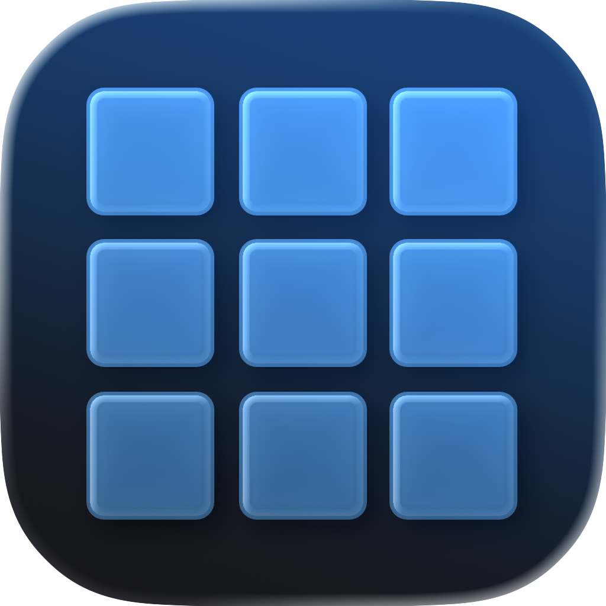
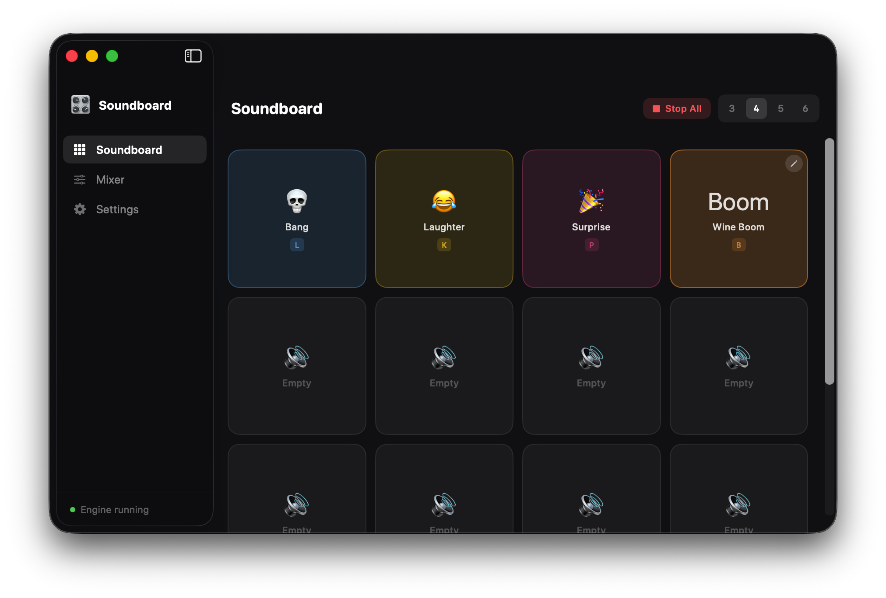
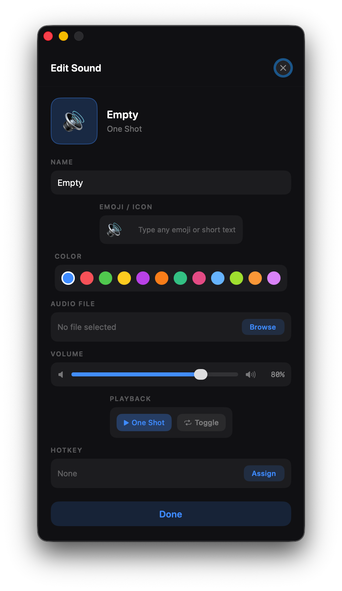

<h1>
   mac-soundboard
</h1>

A macOS soundboard app that combines sound effects with your microphone into a virtual audio device — works with Discord, OBS, or any app that takes mic input.

Built in Swift / SwiftUI.
(With a clean enough UI) 



-----

## Features

- **Sound board** — grid of assignable sound buttons, trigger with click or keyboard
- **Global hotkeys** — key bindings work in any app, not just when the window is focused
- **Virtual mic** — mixes your voice + sounds into a single audio output via BlackHole
- **Per-channel volume** — independent volume control for mic and each sound slot
- **Simultaneous playback** — sounds layer and overlap without cutting each other off
- **Profiles** — save and load different board layouts
- **Sound modes** - edit your sound slots with many diffrent features

<p align="center">
  
</p>

-----

## Requirements

- macOS 13+
- [BlackHole 2ch](https://github.com/ExistentialAudio/BlackHole) (virtual audio driver — free, open source)
- Accessibility permission (for global hotkeys)

-----

## Setup

1. Install [BlackHole 2ch](https://github.com/ExistentialAudio/BlackHole)
1. Build and run the app
1. Grant Accessibility permission when prompted (System Settings → Privacy & Security → Accessibility)
1. In your app (Discord, OBS, etc.) set the mic input to **BlackHole 2ch**

-----

## How it works

```
Real Mic Input (AVAudioEngine tap)
          ↓
      Mixer Node  ←── Sound slots (AVAudioPlayerNode × N)
          ↓
  BlackHole 2ch output  ←── Discord / OBS sees this as mic
```

Global hotkeys are handled via `CGEventTap`. Audio pipeline is built on `AVAudioEngine` with one `AVAudioPlayerNode` per sound slot.

-----

## Stack

- Swift / SwiftUI
- AVAudioEngine + AVAudioPlayerNode
- CGEventTap
- BlackHole (virtual audio HAL driver)

-----

> [!NOTE]
> This is a personal tool, not a polished product. I might add more features in the future. No App Store release planned.
